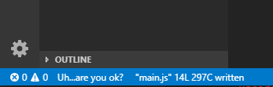

# Discourage

Ever feel like there is a bit too much encouragement in your office? Isn't too much of anything bad? Discourage is meant to bring your life into balance by offering a little discouragement to counter all the encourgement inflating your ego.

Discourage Package for Visual Studio Code, inspired by [@rebornix](https://github.com/rebornix)'s [vscode-encourage](https://github.com/rebornix/vscode-encourage).

A Visual Studio Code extension that discourages you while you work. It will be triggered automatically when the active document is saved or manually by command `Toggle Discourage`.

## Credit

All kudos to [@rebornix](https://github.com/rebornix)
